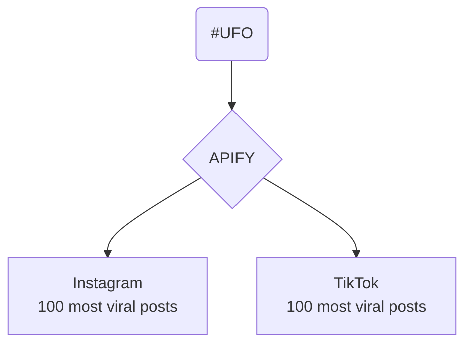

# DDD-2025-GroupX
[Group member names] Ginevra Terenghi; Antonella Autuori
## [Project title] Trillullì

### Visualisation
# Upload here your visualisation. You can use a screenshots, a video/gif (if you need to show the interaction)
# Link to the prototype or website (if available)

### Abstract (300 charachters)
This project investigates how people claim to communicate with alien species by gathering posts, reports, and shared experiences from online communities and public archives. The material was organized, coded, and grouped to uncover repeating themes and moments of collective attention. To make the findings clearer, the grouped data was transformed into timelines and location-based views that show when and where the conversations intensified. The highlights point to shared narratives appearing across different communities, synchronized waves of reported signals, and recurring ideas about how contact might take place.

### Protocol Diagram

### What topic does the visualisation address?

### What data have you considered?
# Specify the format and sources. Use also images/screenshots to describe your dataset.

### What does the visualisation show?
# List three key insights emerging from your visualisation. 

